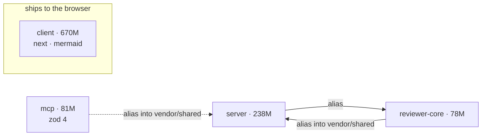

# Dependency checker

Answers four questions in this order, and refuses to answer the fourth without
the first three: **what is installed · what does it cost · where does it
disagree · what should we do.**

Never estimate a size or a version. Every number in the report comes from
[`scripts/survey.sh`](scripts/survey.sh); measurement notes are in
[`README.md`](README.md), and the report shape is fixed by
[`TEMPLATE.md`](TEMPLATE.md).

## Step 0 — the two facts that make this repo different

**There is no workspace.** Six packages, six `package.json` files, six
lockfiles, three of them npm and two pnpm. Nothing hoists, nothing dedupes
across packages, and "we use zod" is a coincidence of six independent version
ranges — not a shared dependency. Every conclusion is per package until proven
otherwise.

**Packages consume each other as TypeScript source, through tsconfig path
aliases.** That is the edge npm cannot see and the one that makes version drift
dangerous: when `mcp` aliases `@devdigest/shared` to `server/src/vendor/shared`,
tsc pulls those files into **mcp's** program and resolves their bare imports
against **mcp's** `node_modules`. Two packages at different major versions of a
shared library are fine until one of them reads the other's source.

## Step 1 — measure

```sh
.claude/skills/dependency-checker/scripts/survey.sh          # markdown to stdout
.claude/skills/dependency-checker/scripts/survey.sh --top 20 # deeper size lists
```

Read-only: no install, no network, no lockfile writes. It excludes
`server/clones/**` — a full copy of this repository, including its
`node_modules`, which doubles every number if it leaks into a scan.

A package with no `node_modules` reports `not installed`. Say so in the report
rather than omitting the row; a missing measurement and a zero are different
claims.

## Step 2 — draw the graph

One diagram, and it shows **mechanism**: which package pulls which, by what
edge. A box per folder is `ls` with rounded corners, not a diagram.

- Solid arrow = tsconfig path alias (source consumed, one tsc program).
- Dashed arrow = the same external package declared in both, independently.
- Annotate a node only with what changes a decision: install size, and the
  version when it differs from its neighbour's.



Keep it under about a dozen nodes. If it needs more, the report is answering
too many questions at once.

## Step 3 — weigh, and say which weight

**"How much does it weigh" has four different answers here, and using the wrong
one produces confident nonsense.**

| Package | The weight that matters | Why |
| --- | --- | --- |
| `client` | **bytes shipped to the browser** | Next.js bundles. `node_modules` size is nearly irrelevant — `@next/swc-darwin-arm64` is 124 MB of native compiler that never reaches a user. |
| `server` | install size + cold start | It runs from source (tsx) or `dist`; its `node_modules` ships to the host. |
| `reviewer-core`, `mcp`, `evals` | their consumers' typecheck | They never emit JS — `build` is a typecheck. Their deps matter when a consumer's tsc pulls their source in and has to resolve `openai`, `zod`. |
| `e2e` | CI install time | Nothing else. |

So: report on-disk size for `server`, and for `client` report it **only** as an
install-time cost, explicitly separated from bundle impact. If a client claim is
about the bundle and no bundle measurement was taken, say the measurement is
missing — do not substitute the disk number.

Native, platform-specific artifacts (`@next/swc-*`, `@img/sharp-*`,
`@esbuild/*`, `lightningcss-*`) are a category, not individual findings. Group
them, state the total, and move on — nobody is going to remove a compiler.

## Step 4 — find the disagreements

In order of how much they cost:

1. **A different major across a path-alias edge.** This is the finding worth
   opening the report with. Two packages at different majors of a library, where
   one consumes the other's source: one tsc program, two type universes.
2. **A different range in `package.json`** — will drift on the next install even
   if it agrees on disk today.
3. **Different patch/minor installed** — usually noise. Report it as one line,
   not one finding per package.
4. **A dependency one package has and a sibling doing the same job does not.**

`vendor/**` is not a dependency and never appears in a lockfile. The two copies
of `@devdigest/shared` are vendored source and have already drifted; that is a
contract problem, not a dependency problem, and it belongs in a different report.

## Step 5 — prioritise

Rank by consequence, not by size. The order is fixed:

| Rank | Class | Test |
| --- | --- | --- |
| **P0** | breaks or will break a gate | typecheck, `pnpm arch`, a test suite, or a build fails — or does today only by luck |
| **P1** | reaches the user | bytes in the browser bundle, cold start, a runtime the product pays for |
| **P2** | costs the team repeatedly | CI install minutes, a manual step nobody can automate |
| **P3** | tidiness | unused, duplicated, or a range that will drift |

A 150 MB native compiler is P3. A 40 KB library at two majors across an alias
edge is P0. Size is an input to the ranking, never the ranking itself.

## Step 6 — advise

Every recommendation carries three things or it is not a recommendation:

1. the exact command or the file and line to change,
2. what it costs — install size, a version bump, a migration,
3. **the gate that proves it worked**, from the real command table in the root
   `AGENTS.md`.

Two standing rules for this repository:

- **Never run the wrong package manager in a package.** `server` and `client`
  are pnpm; `reviewer-core`, `e2e`, `mcp` and `evals` are npm. An `npm install`
  in `server/` writes a second lockfile and the next `pnpm install
  --frozen-lockfile` in CI fails.
- **Never propose converting the repo to a workspace as a side effect.** The
  standalone-package split is a recorded decision with per-package CI path
  filters resting on it (root `INSIGHTS.md`, 2026-07-31). It is an ADR, not a
  cleanup.

## Output

Fill [`TEMPLATE.md`](TEMPLATE.md). Do not invent sections, and do not drop the
`Not measured` one — a report that hides its own blind spots is worse than a
short one.

Write it to `docs/dependencies/<YYYY-MM-DD>.md` when the user wants it kept;
otherwise answer in the conversation using the same headings.

## Before you finish

1. Every number traces to a `survey.sh` line — none estimated.
2. The diagram distinguishes alias edges from coincidental shared deps.
3. Every client size claim says whether it is disk or bundle.
4. Every P0/P1 item names a command and a gate.
5. `Not measured` lists what was skipped and why.
6. Nothing recommends a workspace migration, a lockfile regeneration, or the
   wrong package manager.

---

## Version history

| Version | Change |
| --- | --- |
| 1.0.0 | First version. Fixes the four-question order, the per-package definition of "weight", the P0–P3 ranking, and the survey script as the only source of numbers. |
