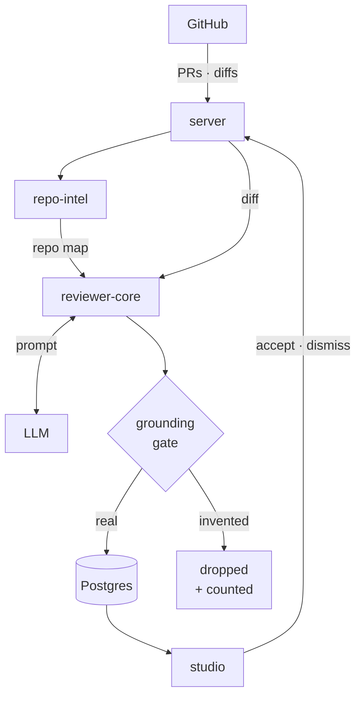
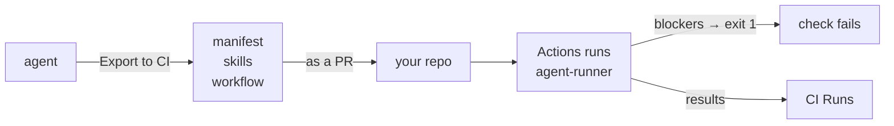

# DevDigest

Local-first AI pull-request review. Import a repository, index it, point one or
several agent reviewers at a PR, and get grounded findings back — with the diff, the
prompt and the cost of every run visible.

Everything runs on your machine. Only Postgres is containerised; the API, the web
app and every reviewer run in your own process against your own API keys.

## What it does

| Surface | What it is |
| --- | --- |
| **Pull Requests** | Import PRs, read the diff, run a review, accept or dismiss findings |
| **Agents** | A reviewer = provider + model + system prompt + linked skills. Create your own |
| **Skills** | Reusable review instructions an agent can be given |
| **Conventions** | House rules extracted from your code, each with evidence that checked out |
| **Project Context** | What the repo is for, fed into every review |
| **Onboarding Tour** | A generated walkthrough of an unfamiliar codebase |
| **Multi-Agent Review** | Fan several agents at one PR, compare findings side by side, see where they disagree |
| **Export to CI** | Ship an agent into a repo's GitHub Actions so it reviews every PR |
| **CI Runs** | Every review that ran in CI, plus the repo's own Actions history |
| **Agent Performance** | Cost, latency and accept-rate per agent over stored runs |
| **Eval Dashboard** | Cases and scores for the agents and skills themselves |
| **Memory** | The RAG store — what has been learned and recalled into reviews |

## The parts

Seven standalone packages. **Not a monorepo workspace** — each has its own
`package.json` and its own lockfile, and cross-package code is shared through
tsconfig path aliases rather than published modules.

| Folder | Package | What it is | Runs on | PM |
| --- | --- | --- | --- | --- |
| `server/` | `@devdigest/api` | Fastify API + Drizzle/Postgres (pgvector) | :3001 | pnpm |
| `client/` | `@devdigest/web` | Next.js 15 studio, App Router | :3000 | pnpm |
| `reviewer-core/` | `@devdigest/reviewer-core` | Pure engine: diff + repo map → prompt → LLM → findings | — | npm |
| `agent-runner/` | `devdigest-agent-runner` | The CI half of an exported agent — an ncc bundle for GitHub Actions | — | npm |
| `mcp/` | `devdigest-mcp` | The reviewers as MCP tools over stdio | — | npm |
| `e2e/` | `@devdigest/e2e` | Deterministic browser flows, no LLM | — | npm |
| `evals/` | `@devdigest/evals` | Two harnesses for the agents and skills themselves | — | npm |
| `server/src/vendor/shared` | `@devdigest/shared` | Zod contracts every package validates against | — | — |

Two things follow from that layout and are easy to get wrong:

- **`reviewer-core` and `mcp` never emit JavaScript.** They are consumed as
  TypeScript source, so their `build` is a typecheck. A package that path-aliases
  into `server/src/vendor/shared` *cannot* emit — tsc pulls those sources into the
  program and would write them under its own `dist/`.
- **Run the right package manager.** `server/` and `client/` are pnpm; everything
  else is npm.

`repo-intel`, the indexer behind the **Indexed** badge and the repo map that grounds
every review, lives inside the server at
[`server/src/modules/repo-intel`](server/src/modules/repo-intel).

## Architecture

**The review loop** — everything here runs on your machine.



Every finding passes the gate before it is stored, and the number dropped is on the
run's record. That is what makes the output worth reading.

**The CI path** — how an agent leaves your machine and reviews PRs on its own.



`agent-runner` is a self-contained bundle committed into the target repo. It never
calls back to the studio, and fork PRs are skipped rather than handed secrets.

**The grounding gate is the load-bearing part.** A finding whose file or line the
model invented is dropped before it reaches you, and the count of dropped references
is on the run's record. That is what makes the findings worth reading.

## Quick start

Node ≥ 22 · pnpm ≥ 10 · Docker.

```sh
./scripts/dev.sh
```

Starts Postgres, creates `.env` files from their examples, installs what is missing,
applies migrations, seeds demo data, and launches both servers. Open
**http://localhost:3000**.

Flags: `--no-seed` · `--no-client` · `--db-only` · `--help`. Ctrl-C stops the dev
servers; Postgres keeps running.

Add your keys in `server/.env` (`ANTHROPIC_API_KEY` / `OPENAI_API_KEY` /
`OPENROUTER_API_KEY`, `GITHUB_TOKEN`) or through Settings at runtime. Secrets can
also live in `~/.devdigest/secrets.json` (mode 0600) — never in git, never in the
database.

## Commands

| Task | Command |
| --- | --- |
| Everything | `./scripts/dev.sh` |
| Server | `cd server && pnpm dev \| build \| typecheck \| test \| arch` |
| Migrations | `cd server && pnpm db:generate` then `pnpm db:migrate` |
| Client | `cd client && pnpm dev \| build \| typecheck \| test \| lint` |
| Engine | `cd reviewer-core && npm test \| npm run typecheck` |
| CI runner | `cd agent-runner && npm run build` (produces the bundle Export to CI ships) |
| MCP | `cd mcp && npm test \| npm run typecheck` |
| E2E | `cd e2e && npm run e2e:hermetic` |
| Evals | `cd evals && pnpm eval:quality` (free) · `eval:skills \| eval:agents \| eval:workflow` (spend) |

Six workflows under `.github/workflows/` are **path-filtered** — a change outside
every filter is checked by nothing but the local gates.

## Conventions you cannot infer from the code

- **`AGENTS.md` is the real file; `CLAUDE.md` is a symlink to it** in every package.
  Edit `AGENTS.md`; never replace the symlink with a copy or the two will drift.
- **Contracts change in `@devdigest/shared` first**, then in consumers. The same Zod
  schema drives request validation and response serialization. `./scripts/check-shared.sh`
  proves the two copies are identical; `--fix` mirrors **with `--delete`**, so two
  people editing a contract in parallel means one edit disappears silently.
- **Server tests split by filename.** `*.it.test.ts` are DB-backed (testcontainers
  Postgres); everything else must stay hermetic.
- **Two gates are baselined.** `server pnpm arch` ignores a known-violations file and
  `client pnpm lint` exits 0 with pre-existing warnings. Green means *nothing new*,
  not *clean*. Never regenerate the baseline and never `lint --fix` it as part of a
  feature — and measure the counts rather than trusting a doc, they drift.

## Do not touch

- `server/clones/**` — cloned user repos, including a full copy of this repo.
  **Always exclude it from grep and glob** or you will read and edit the wrong file.
- `**/src/vendor/**` — vendored. `vendor/shared` changes only as a deliberate
  contract change.
- `server/src/db/migrations/**` — generated. To change the schema, edit the table in
  `server/src/db/schema/<area>.ts` and run `pnpm db:generate`. Never hand-write one.
- Lockfiles, `node_modules`.

## Gotchas

- **Migrations do not run on boot.** `relation … does not exist` means you skipped
  `pnpm db:migrate`.
- **Never `docker compose down -v`** to "reset". The `-v` destroys the
  `devdigest_pgdata` volume and every imported repo and review with it.
- **The app needs Docker running.** An empty repo list is almost always a stopped
  container or a wrong `NEXT_PUBLIC_API_BASE`, not lost data.
- **Do not run `pnpm build` while `next dev` is live** — it clobbers the dev server's
  chunk cache.
- A run stuck in `running` is usually a crashed process; the server reaps orphans on
  boot.

## How work gets done here

Features are built by a chain of specialised agents — write the spec, plan it
against the real repository, build it phase by phase, verify every stated
requirement, review it independently, then document what shipped.

Start at **[`docs/sdd-chain.md`](docs/sdd-chain.md)**. To use the same chain in
another repository, read
**[`docs/adopting-the-chain.md`](docs/adopting-the-chain.md)** — it says plainly
which parts transfer and which describe only this repo.

The agents are **installed, not checked in**. They come from
[`AIengineerDev/dev-digest-ai-marketplace`](https://github.com/AIengineerDev/dev-digest-ai-marketplace)
and are enabled through `.claude/settings.json`.

## Where to read next

| Path | What |
| --- | --- |
| `AGENTS.md` | The operating manual — routing, conventions, what to read when |
| `specs/` | Intent: numbered requirements and acceptance criteria |
| `plans/` | How an agreed spec gets built, with the gate commands that prove it |
| `docs/` | How the system works today, across packages |
| `INSIGHTS.md` | What was tried and rejected — root, and one per package |
| `design-mocks/INDEX.md` | 28 extracted screen modules. **Never** open the 1.8 MB bundle at the repo root |
| `TESTING.md` | Adding a test, or touching CI |
