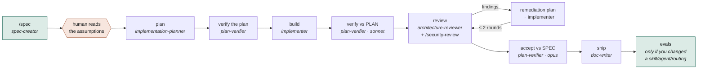

# The SDD chain — spec to shipped

How a feature gets built in this repository, which agent owns each stage, and the
two commands that drive it.

The chain is **installed, not checked in** — the agents and skills come from
[`AIengineerDev/dev-digest-ai-marketplace`](https://github.com/AIengineerDev/dev-digest-ai-marketplace)
and are enabled through `.claude/settings.json`. See `AGENTS.md` for why there is no
local copy.

## The shape



Everything from `plan` onward is one command. The only human gate in the middle is
after the spec.

## The two commands

```bash
/spec add a bulk-export button to the findings table
#   → spec-creator writes specs/NN-name.md, then STOPS
#   → read its ASSUMPTIONS before continuing

/ship specs/NN-name.md
#   → plan → verify the plan → build → verify → review + fix loop
#     → accept → ship
```

`/ship` takes **either** a spec or a plan. Given a spec it plans first; given a plan
it starts at build. Hand it a spec whose plan already exists and it asks rather than
regenerating over it.

To drive the stages by hand instead — one per chat, which is what the chain was
designed for — use the skill directly:

```bash
/sdd-engineering:run-plan plans/NN-name.plan.md   # start: creates the run file, runs build
/sdd-engineering:run-plan                          # next stage
/sdd-engineering:run-plan review                   # exactly one stage
/sdd-engineering:run-plan status                   # report, change nothing
```

State lives in `plans/NN-name.run.md`. It is the only thing that survives between
chats, which is what makes a run resumable after a crash or a context reset.

## Why `/spec` stops

Its report leads with the **assumptions the spec-creator had to make** — states the
design did not cover, corner cases nobody wrote down, decisions it took rather than
found.

That is the one thing worth human eyes. A silent guess in a spec becomes a plan
built on a guess, and by `accept` it has become a requirement nobody agreed to.
Everything after that gate is mechanical enough to automate; that is not.

Editing the spec is the human's job. A revision is **a new numbered file, never an
edit** — `spec-creator` only ever creates, and it is fenced to `specs/` by a
PreToolUse hook rather than by its prompt, so the guarantee is enforced.

## The stages, and who owns each

| Stage | Agent | Checks against | Produces |
| --- | --- | --- | --- |
| plan | `implementation-planner` | the spec | `plans/NN-*.plan.md` |
| verify the plan | `plan-verifier` | the plan itself | verdicts |
| build | `implementer` | — | code + the tests its phases call for |
| verify | `plan-verifier` (**sonnet**) | the **plan** | one verdict per stated item |
| review | `architecture-reviewer` + `/security-review` | the repo's boundaries | findings |
| fix loop | `implementation-planner` → `implementer` | the findings | a remediation plan, then code |
| accept | `plan-verifier` (**opus**) | the **spec** | `R1…Rn` verdicts |
| ship | `doc-writer` | — | docs, and the spec's `Status:` flipped |

Two model choices are deliberate. Pass 1 is mechanical — extract items, find a
`path:line` — so it runs on **sonnet**, and the agent's own rule that a verdict
without evidence is downgraded to `not checkable here` is what keeps a cheaper model
honest. Pass 2 needs judgement about whether a criterion genuinely covers a
requirement, so it keeps **opus**.

## Where it stops for a human

Four points, and none of them are an agent's to decide:

1. A stage's agent asks a question. It is relayed, never answered on its behalf.
2. The fix loop reaches round 2 with findings still open. A third round means a
   disputed finding, or a fix that keeps moving the problem.
3. `accept` reports `not met`. The chain lost a requirement *between documents* —
   the fix is a new plan, not a remediation phase.
4. There is no plan at the given path, or more than one run is open.

## The rules that bite

Each of these cost real time in this repository.

**Commit before the review stage.** `/security-review` computes its own diff and
cannot see untracked files. It has twice reviewed nothing but docs and reported
clean — a false all-clear is worse than no review.

**Do not skip `accept`.** It is the only pass checking against the *spec*, so it is
the only one that can catch a requirement the **planner** dropped; a check against
the plan is blind to it, because the plan is already missing it. A defect shipped
here that contradicted `specs/14-multi-agent-review.md:134` and passed every
plan-level gate — a crashed agent was counted as having "declined to flag", which
turned every finding group into a false conflict. It was found by running the app.

**Carry the verifier's "not checkable here" list to the end.** `test-writer` is
deliberately outside this chain, so **nobody will write those tests**. The coverage
that exists is whatever the plan's own phases told the implementer to write. That
gap is accepted only while it is *visible* — it goes in the run file and in the
closing report, or it quietly becomes a false claim.

**Contracts land first, and alone.** In tracks mode, `@devdigest/shared` changes go
in before the fan-out. Two agents editing a contract in parallel is the one failure
this repo does not absorb: `check-shared.sh --fix` mirrors with `--delete`, so the
loser's edit disappears without an error.

**Only real findings become work.** "Considered and not a finding", a baseline
violation touched but not extended, and a settled decision are not fixes. The
implementer never works from a review report directly — the remediation plan is a
plan file, which is what stops it deciding for itself what is worth fixing.

**Verify the generated plan.** Nobody reviews it by hand when `/ship` drives the
chain. Plans here have shipped with import-path arithmetic that was simply wrong, a
helper signature that introduced a fresh `pnpm arch` violation, and a contract
section missing two of the response shapes its own later phase required.

## Evals — the only test these artefacts have

A skill, an agent and this repo's routing rules have no type checker and no suite of
their own. A broken description or a renamed agent fails silently, at routing time,
in someone else's session.

| You changed | Minimum check |
| --- | --- |
| `.claude/skills/**` | `pnpm eval:quality`, plus that skill's own suite if it has one |
| `.claude/agents/**` | `pnpm eval:quality` + `pnpm eval:agents` + the workflow case that dispatches it |
| `AGENTS.md` / routing rules | `pnpm eval:workflow` — that file **is** the thing under test |
| a case, fixture or grader | re-run the baseline series and re-label it |

```bash
cd evals
pnpm eval:quality     # free, ~100 ms — the only one safe to block CI on
pnpm eval:skills      # spends real money, authenticates with your Claude login
pnpm eval:agents
pnpm eval:workflow
```

Suites that exist today: `evals/skills/onion-architecture`,
`evals/agents/architecture-reviewer`, `evals/workflow`.

## The skills that govern the code

Each plan phase names one. They decide placement, not taste.

| Skill | Governs |
| --- | --- |
| `onion-architecture` | Backend layering under `server/src` — which file, which import direction, who owns transactions. Before adding a route, service, repository or adapter, and when `pnpm arch` fails |
| `frontend-ui-architecture` | Where a file goes under `client/src` — promotion thresholds, route structure, the server/client boundary |
| `repo-conventions` | What no gate catches: which file is authoritative, what is generated, which package manager belongs where |
| `dependency-checker` | External packages only — before adding one, and before a bump PR |

Read or record what a module already learned with
`sdd-engineering:engineering-insights`, at the **start** of a non-trivial task as
well as the end. Silence is a valid outcome; a typo is not an insight.

## Afterwards

`/sdd-engineering:workflow-retro` measures what a run cost and proposes prompt
changes, recording durable findings in `retro/ledger.md`. It is the only thing that
can tell you a fan-out was theoretical, or that a model override never applied.

It is **human-invoked only**. No agent or skill may launch it — spending tokens on a
retrospective is a decision belonging to whoever pays for them. An agent may offer
it in one sentence, then stop.

## Where the commands live

`.claude/commands/spec.md` and `.claude/commands/ship.md`.

`.gitignore` excludes `.claude/*` with explicit exceptions for `skills/`, `agents/`,
`hooks/` and `settings.json` — **not** `commands/`. Until `!.claude/commands/` is
added, these two are personal to one machine and do not travel with the repo.
