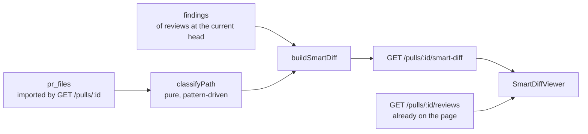

# Smart Diff

**Status:** shipped
**Packages touched:** server, client, e2e

## Problem

A PR's Files changed tab lists files in whatever order GitHub returns them —
usually alphabetical. A reviewer with limited attention therefore spends it in
an order that has nothing to do with risk: `package-lock.json` (+4000) before
the twelve lines of authentication logic that are the actual change.

Two things are already known at import time and cost nothing to use: a file's
path says a great deal about its role, and the last review already recorded
which lines it flagged. Nothing joined them.

## Scope — in / out

**In**

- A deterministic path classifier: `core` / `wiring` / `boilerplate`.
- `GET /pulls/:id/smart-diff` returning the existing `SmartDiff` contract.
- A grouped viewer in the Files changed tab: risk-ordered, boilerplate
  collapsed, per-file findings badges that open the finding's card in the
  Findings tab.
- A split suggestion for PRs too large to review in one sitting.

**Out**

- `pseudocode_summary` ("What this does" in the design mock). It is an LLM
  product and Smart Diff makes no model call; the field stays in the contract,
  served as `null`, for the brief pipeline that does have one.
- Any change to how findings are produced, stored, or graded.
- Per-user ordering preferences. The toggle is Smart / Original, in component
  state, and is not persisted.

## Contract changes

**None.** `SmartDiff`, `SmartDiffGroup`, `SmartDiffFile` and `ProposedSplit`
were already in `@devdigest/shared` (`contracts/brief.ts`) and were implemented
as written.

## How it works

Both inputs are already persisted, so the endpoint is a projection: two SELECTs
and a pure fold. Enforced, not merely intended — `pnpm arch`'s
`smart-diff-spends-nothing` rule fails the build if `modules/smart-diff/` ever
imports the LLM adapter, `reviewer-core`, or the reviews module.

**Where a badge leads.** To the finding, not to the line: clicking one — or a
line's severity chip — sets `?tab=findings&finding=<id>` with a single
`router.replace`, so the tab switch is same-page and the resulting view is
linkable. The Findings tab opens the accordion of the run that produced it,
expands and scrolls to the card, and suspends the severity filters for it: the
click asked for that card, and answering with an empty list because a chip
happens to be off is a bug, not a filter working. A flagged line the loaded
reviews cannot explain (`findingId: null`) has no card, and keeps the
scroll-in-place behaviour instead of pretending to navigate.

**Which findings badge a file.** Every review of the PR's *current head*, not
the newest review row: one "run all agents" writes one review per agent, so the
newest row is a single agent's opinion. A review with no recorded `head_sha`
counts as current — the same tolerant rule `isStaleRun` uses in the UI. This is
what makes the badges agree with the Findings tab.

**When every review is stale.** The badges stay off — a finding about a line
that has since changed must not mark the current diff — but the viewer says so
in one line above the groups: how many findings it is holding back, which commit
they describe, and a *Show them anyway* that jumps to the first of them in the
Findings tab (revealing the stale run there, which that tab hides by default).
Silence here is the failure mode: a diff with no markers and no explanation
reads as "this code is clean", which is the opposite of what a stale critical
finding means.

**Where the numbers come from.** The API is the source of truth for *which*
lines are flagged (`finding_lines`), so the badge count always matches it. The
client looks up severity and title from the reviews it already has; a line it
cannot match still gets a badge, because a silently-dropped one would render a
flagged file as clean.

## Thresholds and patterns

All in one file each, per the task spec:

- `server/src/modules/smart-diff/constants.ts` — role precedence, the three
  pattern sets, split thresholds.
- `client/.../SmartDiffViewer/constants.ts` — which roles start expanded, the
  expand size ceiling, group colours.

## Acceptance criteria

| Criterion | Where it is pinned |
| --- | --- |
| Core first, boilerplate last | `test/smart-diff.it.test.ts`, `smart-diff-helpers.test.ts` |
| A lock file is *always* boilerplate | `smart-diff-helpers.test.ts` (six lock formats + role precedence) |
| Boilerplate starts collapsed | `SmartDiffViewer.test.tsx`, `e2e/specs/09-pr-smart-diff.flow.json` |
| Badges appear after Run Review | `SmartDiffViewer.test.tsx`, `smart-diff.it.test.ts` |
| A badge opens that finding's card in the Findings tab, same page | `SmartDiffViewer.test.tsx` (`onOpenFinding`), `FindingsPanel.test.tsx` (revealed, and unhidden by the filters) |
| A flagged line with no loaded finding still scrolls in place | `SmartDiffViewer.test.tsx` (`scrollIntoView` on the line's DOM id) |
| A diff whose findings are all stale says so, and offers a way through | `SmartDiffViewer.test.tsx` (notice + `Show them anyway` → `onOpenFinding`) |
| No model call on view | `pnpm arch` rule `smart-diff-spends-nothing` |
| Thresholds and patterns in constants | the two `constants.ts` above |

## Open questions

- `package.json` is classified as **boilerplate**, following the design mock. A
  dependency bump is mechanical, but a `scripts` change is not, and the path
  alone cannot tell them apart. Revisit if reviewers report missing it.
- Split proposals are grouped by directory at depth 3. Nothing yet uses the
  import graph, which `repo-intel` could supply and which would propose splits
  that actually compile independently.
