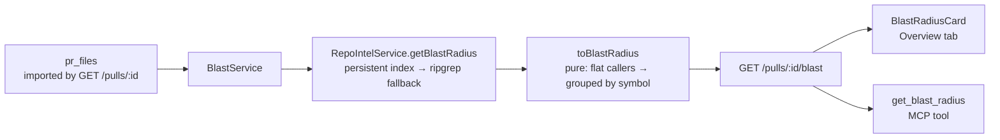

# Blast Radius

**Status:** shipped
**Packages touched:** server, client, mcp

## Problem

A diff says what changed. It does not say what that reaches. A reviewer reading
`rateLimit` gains twelve lines and no answer to the only question that decides
whether the PR is risky: *who calls this, and which routes break if it is
wrong?*

The engine to answer it already existed —
`RepoIntelService.getBlastRadius(repoId, changedFiles)` walks the persistent
import graph and falls back to ripgrep — with **no HTTP route over it**, so
nothing outside the server could ask. The MCP tool `get_blast_radius` had been
registered as a stub returning `not_implemented` precisely to hold the shape
until this landed.

## Scope — in / out

**In**

- `GET /pulls/:id/blast` → the existing `BlastRadius` contract.
- A Blast Radius card on the PR Overview tab: counts, per-symbol callers,
  endpoints and crons, and a graph view.
- `get_blast_radius` un-stubbed, taking the **PR** rather than a file list.

**Out**

- *Prior PRs touching the same files.* The reference walkthrough's tool
  description mentions it, but it is `PrHistory` in the contract, not
  `BlastRadius` — merging the two would be a contract change in service of one
  sentence. Left for whoever builds PR history.
- Re-indexing on demand. A degraded index reports itself as degraded; fixing it
  is `POST /repos/:id/resync`, which already exists.
- Any change to how `getBlastRadius` computes impact.

## Contract changes

**None.** `BlastRadius`, `DownstreamImpact`, `ChangedSymbol` and `BlastCaller`
were already in `@devdigest/shared` (`contracts/brief.ts`).

## How it works

**It takes a PR, not a file list.** The server already knows which files the PR
touches, so the caller supplies one identifier and cannot analyse a diff it
reconstructed wrongly. This was the open question in `specs/06-mcp-server.md`;
the file-list stub answered it the other way and was wrong.

**The flat→grouped mapping is the one real transformation.** The facade returns
callers as a flat list tagged with `viaSymbol`; the contract wants them grouped
under each changed symbol. `modules/blast/helpers.ts` owns that, plus the caps
and the ordering (most-called symbol first — that is the one to think hardest
about).

**Counts are pre-truncation, and endpoints are deduplicated.** The card says
"20 callers" and lists 12; those must not contradict. Two symbols reaching
`POST /webhooks` is one endpoint at risk, not two — summing would inflate the
scariest number on the card.

**A degraded index is an answer, not an error.** Without the persistent index
there is no per-file attribution, so every symbol gets the flat endpoint union
and the summary says the attribution is approximate. Reporting zero would hide
real endpoints; the summary is therefore rendered in *every* state, and is the
first line of the MCP response.

## One bug found and fixed on the way

`RepoIntelService.tryPersistentBlast` capped callers with
`callers.slice(0, MAX_CALLERS_PER_SYMBOL)` — a **flat** slice, despite the
constant's name and doc. A PR touching more symbols than the cap spent the whole
budget on the first few, and every other changed symbol came back with zero
callers. It is invisible below the cap, so no existing fixture caught it; it
showed up the first time this feature ran against a real indexed repo, where two
unrelated PRs both reported *exactly* 20 callers. Now grouped per symbol
(`capCallersPerSymbol`), verified live at 54 and 21, pinned by
`test/repo-intel-caller-cap.test.ts`.

## Thresholds

- `server/src/modules/blast/constants.ts` — 60 symbols, 12 callers and 12
  endpoints per symbol.
- `client/.../BlastRadiusCard/constants.ts` — display fold, graph geometry and
  node colours.

## Acceptance criteria

| Criterion | Where it is pinned |
| --- | --- |
| Overview shows symbols, callers, impacted endpoints | `BlastRadiusCard.test.tsx` |
| The route feeds the PR's own files to the index | `blast.it.test.ts` |
| Flat callers group under the symbol they reach | `blast-helpers.test.ts` |
| A cap never reads as completeness | `blast-helpers.test.ts` (counts vs. list) |
| Graph is deterministic across opens | `BlastRadiusCard.test.tsx` (`layout` twice) |
| Degraded / unimported states are named, not blanked | both server suites + the card test |
| `get_blast_radius` takes the PR and leads with the summary | `mcp/test/tools.test.ts` |
| No model call | no LLM adapter reachable from `modules/blast` |

## Open questions

- The graph is a deterministic radial layout, not a force simulation —
  deliberate, because a picture that settles differently on each open cannot be
  discussed across two runs. It will look crowded past ~6 changed symbols with
  many callers each; a proper hierarchical layout is the fix if that becomes
  common.
- `crons_affected` is populated only on the persistent-index path. Nothing in
  the seeded demo exercises it, so the card's cron stat is effectively untested
  against real data.
